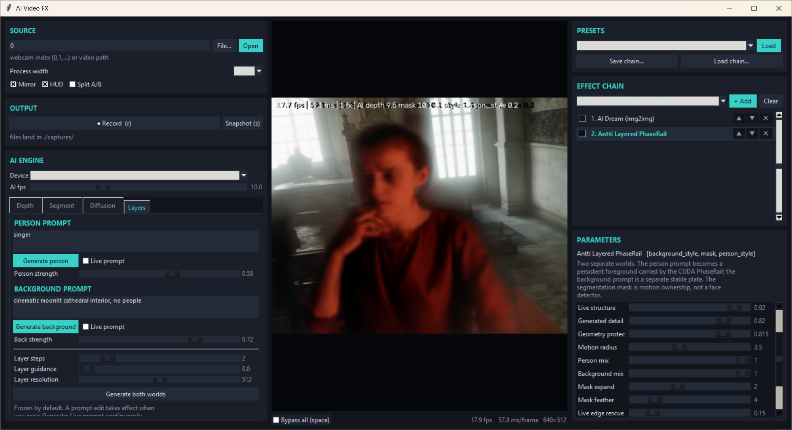

# AI Video FX — Layered PhaseRail build

Video about it: https://youtu.be/Hep1g3-IX4w



This version adds the missing **two-world mode** to the existing AI Video FX
studio:

- a semantic-segmentation worker owns the person matte;
- a separate prompt generates the person appearance;
- Antti's CUDA PhaseRail carries that person keyframe with webcam motion;
- another prompt generates a stable background plate;
- the two layers are composited before the rest of the normal effect chain.

The old depth, segmentation, whole-frame AI Dream and procedural effects remain.

## Install and run

```bat
python3.13 -m pip install -r requirements.txt
python3.13 ai_video_fx.py 
```

The first use downloads the selected Hugging Face models. CUDA is strongly
recommended. The PhaseRail automatically falls back to CPU, but the CPU version
is meant for correctness rather than real-time use.

Headless test:

```bat
python3.13 selftest.py
python3.13 fx_phase_rail.py
```

## The layered workflow

1. Load the **Antti Layered Dream** preset, or add **AI Layers · Antti Layered
   PhaseRail** to any chain.
2. In **AI ENGINE → Segment**, keep the target class as `person`.
3. Open **AI ENGINE → Layers**.
4. Type a person prompt and press **Generate person**.
5. Type a background prompt and press **Generate background**.
6. Leave both **Live prompt** boxes off for stable frozen keyframes.
7. Move gently. The foreground keyframe is transported by PhaseRail while the
   generated background remains a separate plate.

Changing the prompt does not destroy the current image while you type. In frozen
mode, the new text takes effect only after the matching Generate button is
pressed.

Turning on **Live prompt** makes that layer generate new keyframes continuously.
This is intentionally optional: it is expensive and less stable, but useful for
slowly evolving dream-video effects.

## NEW: Causal Refresh — only re-imagine when transport stops explaining the present

This repo now contains a deliberately separate experimental sibling effect:

```bat
python3.13 ai_video_fx_causal.py --preset "Antti Causal Refresh"
```

or on Windows:

```text
run_causal_refresh.bat
```

It does **not** alter the original `Antti Layered PhaseRail` effect. Importing
`fx_causal_refresh.py` registers one extra effect/preset named **Antti Causal
Refresh**.

The loop is:

```text
expensive generated person keyframe
             |
             v
      PhaseRail transport
             |
             v
cheap live structure comparison
             |
      still adequate?
       /          \
     yes           no
      |             |
   continue      request a fresh
  transport      person keyframe
```

The refresh detector deliberately does **not** compare raw RGB. A prompted
marble statue or robot should not be declared wrong merely because it has a
different colour from the webcam. `causal_refresh.py` compares separately
contrast-normalised blurred edge structure inside the person ownership mask,
then adds smaller penalties for low PhaseRail confidence and motion near the
configured transport radius.

The instantaneous score is accumulated with a leaky memory:

```text
evidence[t] = decay * evidence[t-1] + instant_mismatch[t]^2
```

When evidence crosses **Refresh threshold** and the current generated keyframe
is older than **Min key age**, the effect asks the existing diffusion worker for
a replacement. It keeps a private copy of the old keyframe and continues
rendering/transporting it while the new diffusion image is being generated, so
the subject does not blink back to raw webcam.

The effect exposes these controls in the ordinary effect parameter panel:

- **Auto refresh** — enable/disable the controller.
- **Refresh threshold** — how much persistent mismatch is required before
  spending another diffusion call.
- **Refresh memory** — leakage/forgetting of old mismatch.
- **Min key age (s)** — prevents immediate refresh loops after a new keyframe.
- **Show refresh meter** — live evidence bar at the bottom of the video.

This is a heuristic controller, not a calibrated probability or an optimality
claim. The first experiment to run is simple: same prerecorded motion, compare
manual/fixed refresh against causal refresh, counting diffusion calls and
measuring visible geometry/identity drift.

Cheap controller tests (no diffusion model needed):

```bat
python3.13 -m unittest test_causal_refresh -v
```

The same tests run in GitHub Actions as `causal-refresh-ci`.

## Important PhaseRail controls

- **Phase lock** — how strongly the generated person follows the persistent rail.
- **Live structure** — how much webcam low-frequency geometry enters the person.
- **Generated detail** — how much prompted high-frequency appearance is retained.
- **Geometry protect** — affine-nullspace protection for newly accepted AI
  keyframes. Keep it at `0` for the strongest puppet effect.
- **Mask expand / feather** — fixes clothing and hair boundaries.
- **Live edge rescue** — borrows a narrow strip of real camera detail at the
  matte edge without letting the camera background leak into the layer.
- **Background X / Y / zoom** — move the frozen generated background live.
- **Show ownership** — displays the actual person ownership field.

## Architecture

```text
camera ────────────────► full-rate effect processor
  │                              │
  ├──► geometry worker           │
  │      depth + person mask ────┤
  │                              │
  └──► diffusion worker          │
         person keyframe ────────┤
         background keyframe ────┤
                                 ▼
                       Antti Layered PhaseRail
                    person rail + background plate
                                 │
                                 ▼
                    normal FX chain / record / UI
```

Depth and segmentation run in a different thread from diffusion. A slow image
generation therefore no longer prevents the ownership mask from updating.

The foreground rail only sees actor-owned pixels. The exterior is replaced by a
neutral field before phase analysis, preventing the stationary room from taking
ownership of the person's motion.

## Optional LivePortrait bridge

The effect list also contains **AI Layers · LivePortrait Layer (bridge)**. It is
a deliberately thin integration point rather than a bundled copy of another
large project.

Whenever the person prompt generates, the app exports:

```text
layer_person_keyframe.png
```

An external LivePortrait or FasterLivePortrait process can use that as its
source image and write its latest animated frame to:

```text
live_portrait_latest.png
```

The file names are editable in the Layers tab. While the bridge effect is in
the chain, the app watches that output file and composites it over the prompted
background using the same live person matte. This keeps the external portrait
system replaceable and avoids forcing its separate model environment into the
main application.

## Files

| file | role |
|---|---|
| `ai_video_fx.py` | Tk GUI, capture, recording, chain editor, Layers controls |
| `ai_video_fx_causal.py` | optional launcher that registers the causal-refresh sibling effect |
| `fx_ai.py` | separate geometry/diffusion workers and optional portrait file bridge |
| `fx_core.py` | all original effects, including the layered AI effects |
| `fx_phase_rail.py` | reusable CUDA/torch PhaseRail engine |
| `causal_refresh.py` | cheap style-tolerant mismatch accumulator / refresh decision |
| `fx_causal_refresh.py` | sibling PhaseRail effect + `Antti Causal Refresh` preset |
| `selftest.py` | tests every original effect and preset without a camera |
| `test_causal_refresh.py` | controller sanity checks without AI models |
| `requirements.txt` | application dependencies |

## Honest limits

The person/background split removes the worst whole-frame contamination and
stops the room being dragged by the face. It does not create unseen anatomy.
Small head and expression movement is the PhaseRail operating region. Large
turns still require a portrait-animation system or a fresh generated keyframe.

The new causal-refresh controller only decides **when to ask for that fresh
keyframe**. Its edge-structure residual is deliberately cheap and style-tolerant,
but it has not yet been calibrated against human judgement, identity metrics or
real diffusion-call savings. Until that benchmark is run, treat the default
threshold as a starting knob, not a scientifically validated operating point.
